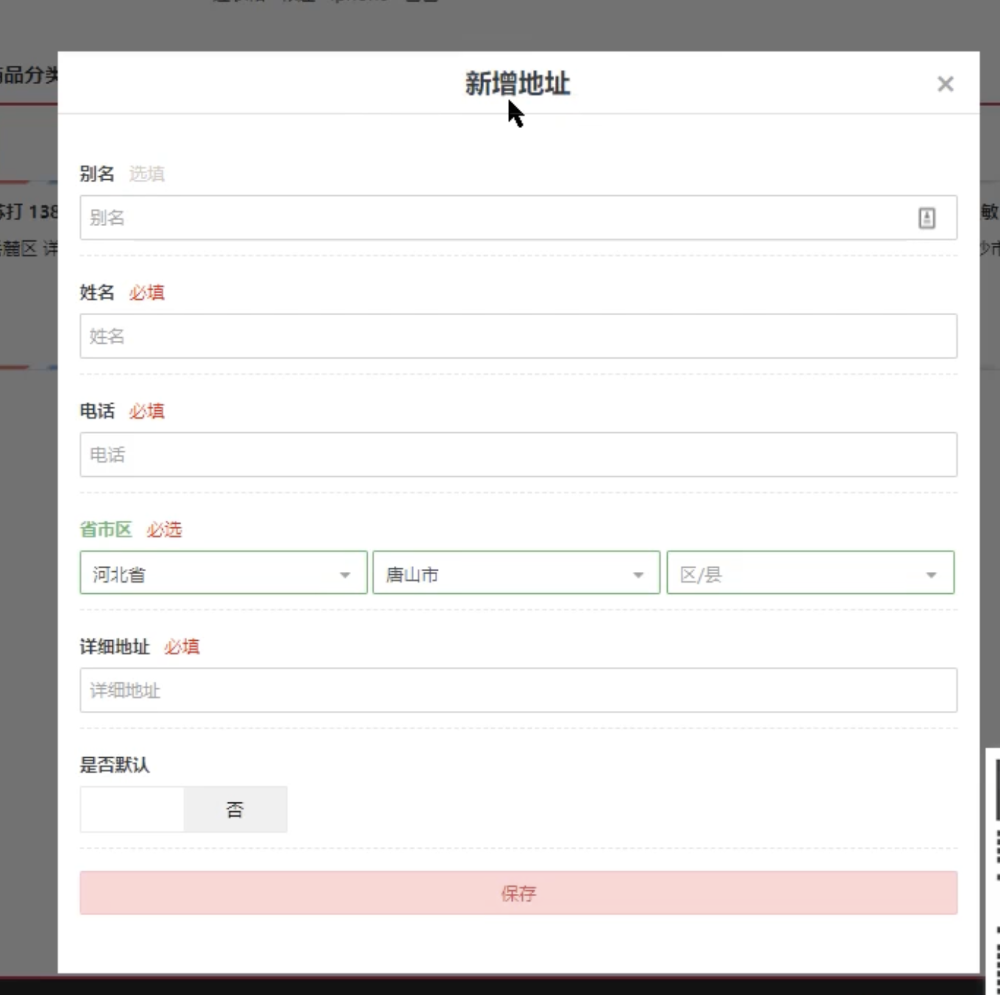

[toc]

## 0. Pytest框架详解

- 是一个非常成熟的python用例测试框架，可以和很多的工具或框架，selenium、requests、appium实现多种自动化测试。
- 可以和**allure**结合生成美观的报告以及和**Jenkins**实现持续集成。
- 有很多插件
  - pytest-html 生成html测试报告 
  - pytest-xdist 多线程运行 
  - pytest-rerunfailures  失败用例重跑
  - pytest-base-url 管理基础路径 
  - allure-pytest 生成allure测试报告
  - pyyaml

## 1. Pytest基本功能

- 入门简单，具有丰富的资料文档，有很多实例可以进行参考
- 具有很多的第三方插件，并且可以自动移扩展功能
- 执行测试用例过程中可以将某些用例进行标记：跳过，指定顺序执行，标记失败，**标记参数化**等
- 支持标间参数化：用例脚本只需要编写一次，那么可以**实现数据驱动测试**完成整个模块的测试内容
- 支持重复执行失败用例
- 便捷管理用例，方便和持续集成工作完成集成任务，便于生成自动化测试报告
- 自动化测试框架的**核心作用**：
    - 定位测试用例
    - 执行测试用例
    - 断言测试用例
    - 生成测试报告
## 2. Pytes常用断言类型

```python
== 等于

!= 不等于

\> 大于

< 小于

in 属于

not in 不属于

\>= 大于等于

<= 小于等于

is 是

is not 不是

```


## 3. pytest用例执行规则
通常情况下项目中所有的用例会集成进行管理
- 创建testcases包
默认执行规则
- 包名，以及模块名，用例名（函数，方法）**符合以test开头或者test结尾**
- 如果用例以方法的形式定义，那么类必须是以Test开头，而且不能有init构建函数
## 4. pytest用例执行方式

- 终端交互式执行
    - pytest会执行所有符合默认规则的用例
    - pytest执行用例可选参数
        - -v 会显示用例的详细内容
        - -s 会显示输出内容
        - -k 筛选用例 指定以什么开头用例执行
- 创建主函数执行
    ```python
    import pytest
    if __name__ == '__main__':
        pytest.main()
        #pytest.main(['-v', '-s', '-k', 'test_demo'])
    ```
## 5. pytest标记跳过用例
- 无条件跳过
    ```python
    import pytest
    
    @pytest.mark.skip(reason='无条件跳过')
    def test_skip():
        assert 1 == 2
    ```
- 有条件跳过
    ```python
    import pytest
    
    # 跳过条件成立，用例不执行
    @pytest.mark.skipif(True, reason='有条件跳过')
    def test_skipif():
        assert 1 == 2
    @pytest.mark.skipif(2>1, reason="反例不执行")
    def test_run1():
        print("test_run1")
    
    # 跳过条件不成立，用例正常执行
    @pytest.mark.skipif(2<1, reason="正例执行")
    def test_run2():
        print("test_run2")
    ```
## 6. pytest控制用例顺序
- 用例执行顺序默认是按照模块名和用例名从上往下的执行顺序。
- 需要改变默认执行方式，可以使用pytest-ordering插件来改变用例执行顺序。
- 安装**pytest-ordering**插件
    ```python
    pip install pytest-ordering
    ```
- 如果传递了关键字参数，**order数字越小越先执行**，其他没有做装饰器执行顺序的标记按照原来的执行顺序执行。
    ```python
    import pytest
    import pytest_ordering
    @pytest.mark.run(order=1)
    def test_run1():
        print("test_run1")
    @pytest.mark.run(order=2)
    def test_run2():
        print("test_run2")
    ```
## 7. pytest标记用例执行失败
标记预期会出现异常或者失败的用例，只有出现异常才符合预期，不出现异常反而错误。
- 标记失败
    ```python
    import pytest
    # 标记失败，不执行
    @pytest.mark.xfail(reason="a未定义")
    def test_run3():
        print(a)
        print("test_run3")
    # 标记失败，执行
    @pytest.mark.xfail(reason="标记失败，执行")
    def test_run4():
        print("test_run4")
    ```
    1. 用例出现异常执行结果
       - XFAIL: 标记失败，不执行
    2. 用例出现异常执行结果
       - XPASS

## 8. setup/teardown

setup 前置功能 

teardown 后置功能

#### 8.1模块级 

setup_module/teardown_module 开始于模块始末，生效一次

```python
import requests

# 模块级setup/teardown
def setup_module():
    print("准备测试")

def teardown_module():
    print("结束测试")

def test_xray_availability():
    url = 'http://10.21.25.54:3000/'
    params = {
        'name': 'heyuyang',
        'password': 'heyuyang'
    }
    response = requests.get(url, params)
    assert response.status_code == 200
    print("请求的url是: ", response.url)

def test_baidu_availability():
    url = 'https://www.baidu.com'

    response = requests.get(url)

    assert response.status_code == 200
    print("请求的url是:", response.url)
>>>>
```

#### 8.2函数级 

setup_function/teardown_function 对每条函数用例生效(不在类中)

```python
# 函数级setup/teardown

def setup_function():
    print("准备测试")


def teardown_function():
    print("结束测试")

def test_xray_availability():
    url = 'http://10.21.25.54:3000/'
    params = {
        'name': 'heyuyang',
        'password': 'heyuyang'
    }
    response = requests.get(url, params)
    assert response.status_code == 200
    print("请求的url是: ", response.url)


def test_baidu_availability():
    url = 'https://www.baidu.com'

    response = requests.get(url)
    assert response.status_code == 200
    print("请求的url是:", response.url)
>>>
```

#### 8.3 类级 

setup_class/teardown_class 只在类中前后运行一次(在类中)

```python
# -*- coding: utf-8 -*-
# @Time    : 2024/3/14 13:48
# @Author  : heyuyang 
# @Project : TestProject 
# @Module  : 
# @File    : test_setup_teardown_class.py
import pytest
import requests


# 类级setup/teardown

class TestSetupTeardown:

    def setup_class(self):
        print("准备测试")

    def teardown_class(self):
        print("结束测试")

    def test_xray_availability(self):
        url = 'http://10.21.25.54:3000/'
        params = {
            'name': 'heyuyang',
            'password': 'heyuyang'
        }
        response = requests.get(url, params)
        assert response.status_code == 200
        print("请求的url是: ", response.url)

    def test_baidu_availability(self):
        url = 'https://www.baidu.com'

        response = requests.get(url)

        assert response.status_code == 200
        print("请求的url是:", response.url)
```

#### 8.4 方法级 

setup_method/teardown_method 开始于方法始末(在类中)

```python
# -*- coding: utf-8 -*-
# @Time    : 2024/3/14 13:54
# @Author  : heyuyang 
# @Project : TestProject 
# @Module  : 
# @File    : test_setup_teardown_method.py
import pytest
import requests


def setup_module():
    print("准备module测试\n")


def teardown_module():
    print("结束module测试")


# method setup/teardown

class TestSetupTeardown:

    def setup_class(self):
        print("准备class测试\n")

    def teardown_class(self):
        print("结束class测试")

    def setup_method(self):
        print("准备method测试\n")

    def teardown_mthod(self):
        print("结束method测试")

    def test_xray_availability(self):
        url = 'http://10.21.25.54:3000/'
        params = {
            'name': 'heyuyang',
            'password': 'heyuyang'
        }
        response = requests.get(url, params)
        assert response.status_code == 200
        print("请求的url是: ", response.url)

    def test_baidu_availability(self):
        url = 'https://www.baidu.com'

        response = requests.get(url)

        assert response.status_code == 200
        print("请求的url是:", response.url)
```

#### 8.5 所有级别嵌套

```python
# -*- coding: utf-8 -*-
# @Time    : 2024/3/14 14:04
# @Author  : heyuyang 
# @Project : TestProject 
# @Module  : 
# @File    : test_setup_teardown_all.py

# 所有setup/teardown嵌套

import pytest
import requests

def setup_module():
    print(">>>>>准备module测试\n")

def teardown_module():
    print("结束module测试<<<<<")

def setup_function():
    print(">>>>>准备function测试\n")

def teardown_function():
    print("结束function测试<<<<<")

def test_post():
    assert 1 == 1

class TestSetupTeardown:

    def setup_class(self):
        print(">>>>>准备class测试\n")

    def teardown_class(self):
        print("结束class测试<<<<<")

    def setup_method(self):
        print(">>>>>准备method测试\n")

    def teardown_method(self):
        print("结束method测试<<<<<")

    def test_xray_availability(self):
        url = 'http://10.21.25.54:3000/'
        params = {
            'name': 'heyuyang',
            'password': 'heyuyang'
        }
        response = requests.get(url, params)
        assert response.status_code == 200
        print("请求的url是: ", response.url)

    def test_baidu_availability(self):
        url = 'https://www.baidu.com'
        response = requests.get(url)
        assert response.status_code == 200
        print("请求的url是:", response.url)


if __name__ == '__main__':
    pytest.main(["-vs"])

---------------------------------------------------------------------------------------------
>>>>>准备module测试

>>>>>准备function测试
PASSED
结束function测试<<<<<

test_setup_teardown_all.py::TestSetupTeardown::test_xray_availability 
>>>>>准备class测试
>>>>>准备method测试
请求的url是:  http://10.21.25.54:3000/?name=heyuyang&password=heyuyang
PASSED
结束method测试<<<<<

test_setup_teardown_all.py::TestSetupTeardown::test_baidu_availability 
>>>>>准备method测试
请求的url是: https://www.baidu.com/
PASSED
结束method测试<<<<<

结束class测试<<<<<

结束module测试<<<<<
```

## 9.pytest的夹具 fixture

夹具：在测试用例之前、或者之后自动的执行一些代码

如果测试用例需要已登录的状态，但是“登录”不是当前的用例测试步骤，将“登录”前置到夹具中

fixture相对于setup和teardown来说具有以下优势：

- fixture 命令更加灵活，局限性较小
- conftest.py配置里面可以实现数据共享，不需要import就能自动找到一些配置。

#### 0. fixture 参数

```python
import pytest
@pytest.fixture(scope="",params="",autouse="",ids="",name="")    
def driver():
	driver = get_webdriver()
    driver.get("https://www.baidu.com") # 访问首页
    driver.maximize_window()
    return driver
```

**pytest.fixture(scope="",params="",autouse="",ids="",name="")**

- scope: 
      作用域 默认*function，class module session/package*

  - 1. $\color{red}function$： **默认**，每个用例执行一次

    2. class： 每个类执行一次
    3. module： 每个文件执行一次
    4. $\color{red}package$： 每个包执行一次
    5. $\color{red}session$：整个测试过程只执行一次
    6. 作用范围: session> module>class>function

- params:数据驱动

  ```python
  # -*- coding: utf-8 -*-
  # @Time    : 2024/3/16 15:45
  # @Author  : heyuyang 
  # @Project : TestProject 
  # @File    : test_login.py
  # @Desc    :
  import pytest
  
  def read_yam():
      return ['h', 'a', 'b']
  
  
  @pytest.fixture(scope="function", autouse=False, params=read_yam())
  def a_assert(request):
      print("在用例之前执行：select database for assert")
      yield request.param
      print("在用例之后执行：select database for assert")
  
  class TestUser:
  
      def test_login(self):
          print("login")
  
      def test_register(self, a_assert):
          print("register: " + a_assert)
  
      def test_logout(self):
          print("logout")
  
  ```

- autouse：自动作用还是手动作用

   True自动调用，False手动调用(需要在参数里面传入driver)

- ids: 当数据驱动时更改参数名 

  ```python
  @pytest.fixture(scope="function", autouse=False, params=read_yam(), ids=[1, 2, 3])
  def a_assert(request):
      print("在用例之前执行：select database for assert")
      yield request.param
      print("在用例之后执行：select database for assert")
      
  class TestUser:
  
      def test_login(self):
          print("login")
  
      def test_register(self, a_assert):
          print("register: " + a_assert)
  
      def test_logout(self):
          print("logout")
  test_register[\u4f55] 在用例之前执行：select database for assert
  PASSED                    [ 33%]register: 何
  在用例之后执行：select database for assert
  >>>>>>>>>>>>>>>>>>>>>>>>>>>>>>>>>>>>>>>>
  test_login.py::TestUser::test_register[1] 在用例之前执行：select database for assert
  PASSED                         [ 33%]register: 何
  在用例之后执行：select database for assert
  ```

- name：fixture的别名

  ```python
  @pytest.fixture(scope="function", autouse=False, params=read_yam(), ids=[1, 2, 3],name= 'as')
  def a_assert(request):
      print("在用例之前执行：select database for assert")
      yield request.param
      print("在用例之后执行：select database for assert")
      
  class TestUser:
  
      def test_login(self):
          print("login")
  
      def test_register(self, as):
          print("register: " + as)
  
      def test_logout(self):
          print("logout")
  ```

#### 1. 定义夹具

```python
import pytest
import sleep

@pytest.fixture()    
def driver():
	driver = get_webdriver()
    driver.get("https://www.baidu.com") # 访问首页
    driver.maximize_window()
    return driver
```

##### 1.1 conftest.py

专门用来保存fixture固件,**且调用其中的固件不需要导包**

#### 2. 使用夹具    

```python
def test_login_ok(driver):
    driver.find_element(By.LINK_TEXT, "登录").click()
    driver.find_element(By.XPATH,
                         "//input[@placeholder="请输入用户名/手机邮箱"]",
                        ).send_keys("heyuyang")
    driver.find_element(By.XPATH,
                         "//input[@placeholder="请输入登录密码"]",
                        ).send_keys("123456")
    driver.find_element(By.XPATH, '//button[text()="登录"]').click()

    time.sleep(0.5)

    msg = driver.find_element(By.XPATH, '//p[@class="prompt-msg"]').text
    assert msg == "登录成功"
```

#### 3. 重点 

1. ##### 夹具的前置和后置

   ```python
   import pytest
   import sleep
   
   @pytest.fixture()    
   def driver():
   	driver = get_webdriver()
       driver.get("https://www.baidu.com") # 访问首页
       driver.maximize_window()
       # 前置部分，测试用例之前执行
       # 登录代码
       yield driver
       print("执行完毕")
       # 后置部分，在测试用例执行完毕后执行
       # 登出代码
       driver.quit()
   ```

​		**浏览器启动的次数 = 测试用例的个数**

​		**如何避免重复启动浏览器（每一次启动大概耗时3秒）**

2. ##### 夹具范围
   
   1. $\color{red}function$： **默认**，每个用例执行一次
   2. class： 每个类执行一次
   3. module： 每个文件执行一次
   4. $\color{red}package$： 每个包执行一次
   5. $\color{red}session$：整个测试过程只执行一次
   
    ```python
    @pytest.fixture(scope="session")  # scope 默认function   
    def driver():
        """未登录driver"""
        driver = get_webdriver()
        driver.get("https://www.baidu.com") # 访问首页
        driver.maximize_window()
        # 前置部分，测试用例之前执行
        # 登录代码
        yield driver
        print("执行完毕")
        # 后置部分，在测试用例执行完毕后执行
        # 登出代码
        driver.quit()
    ```

#### 4.解决登录问题 

问题：第一次执行登录成功之后，第二个用例**登录失败**执行失败

- 登录成功之后就无法再登录了
- 自动登录
- 不必重复登录

```python
import pytest

@pytest.fixture(scope="session")  # scope 默认function   
def user_driver():
    """已登录浏览器"""
    driver = get_webdriver()
    driver.get("https://www.baidu.com") # 访问首页
    driver.maximize_window()
    # 前置部分，测试用例之前执行
    # 登录代码
    yield driver
    print("执行完毕")
    # 后置部分，在测试用例执行完毕后执行
    # 登出代码
    driver.quit()
```

#### 5. 解决不进行登录问题

 1. 不重启浏览器

 2. 保持不登录的状态，以便对登录进行测试

网站的登录状态是如何保持的？

- cookie

- selenium清除cookie

  **解决方案：在登录之前清除cookie**
```python
def test_login_fail(driver):
    driver.delete_all_cookies()  # 清除cookie
    driver.refresh() # 刷新页面
    
    driver.find_element(By.LINK_TEXT, "登录").click()
    driver.find_element(By.XPATH,
                         "//input[@placeholder="请输入用户名/手机邮箱"]",
                        ).send_keys("heyuyang")
    driver.find_element(By.XPATH,
                         "//input[@placeholder="请输入登录密码"]",
                        ).send_keys("123456")
    driver.find_element(By.XPATH, '//button[text()="登录"]').click()

    time.sleep(0.5)

    msg = driver.find_element(By.XPATH, '//p[@class="prompt-msg"]').text
    assert msg == "登录失败"
```

## 10.接口自动化测试接口关联封装

应该用文件，数据库保存，yaml

### 0. 接口自动化测试框架文件夹

```
接口自动化测试框架文件夹说明：
    commons:       公共封装文件夹
    datas:         YAML数据驱动文件夹
    hotloads:      热加载文件夹
    logs:          日志文件夹
    reports:       定制的allure报告文件夹
    temps:         临时报告文件夹
    testcases:     YAML测试用例文件夹
    config.yaml:   全局配置文件
    conftest.py:   全局fixture固件
    extract.yaml:  全局接口关联中间变量提取文件
    pytest.ini:    全局pytest配置文件
    run.py:        全局运行文件
    readme.md:     接口自动化测试框架说明文件
    
接口自动化测试框架YAML测试用例规范“：
```


### 1.Pytest用例管理框架数据驱动详解

数据驱动装饰器 **参数化**

```python
@pytest.mark.parametrize(arg1, args2)
arg1:参数名用于传值
args2:参数值(可以为列表，字典列表，字典元组)，数据中有多少个值那么用例就会执行多少次
```

#### 1.单参数单次循环

```python
import pytest

@pytest.parametrize("name",["hyy"])
def test_single_param(name):
    assert name == "hyy"
    
def connect_database():
    # 连接数据库
    connection = pymysql.connect(
        host='localhost',
        user='root',
        password='123456',
        database='PyTestProject',
        cursorclass=pymysql.cursors.DictCursor  # 指定游标类型为字典型，方便取得查询结果
    )
    return connection

def login_check(username):
    connection = connect_database()
    try:
        with connection.cursor() as cursor:
            # 执行查询

            sql = "SELECT * FROM user WHERE name = %s"
            cursor.execute(sql, (username,))

            # 获取查询结果
            result = cursor.fetchone()

            if result:
                print("User found:")
                print(result)
            else:
                print("User not found.")
    finally:
        # 关闭数据库连接
        connection.close()

    return result

@pytest.mark.parametrize("name", ["hyy"])
def test_user_exist(name):
    result = login_check(name)
    assert result is not None

if __name__ == '__main__':
    pytest.main(['-vs'])
```

#### 2.单参数多次循环

```python
import pytest

@pytest.parametrize("name",["hyy", "hwx", "heyuyang"])
def test_single_param(name):
    assert name == "hyy"
```

#### 3.多参数多次循环

```python
import pytest

def connect_database():
    # 连接数据库
    connection = pymysql.connect(
        host='localhost',
        user='root',
        password='123456',
        database='PyTestProject',
        cursorclass=pymysql.cursors.DictCursor  # 指定游标类型为字典型，方便取得查询结果
    )
    return connection

@pytest.fixture(scope='module')
def db_connection():
    connection = connect_database()
    print("连接+1")
    yield connection

    # 关闭数据库连接
    connection.close()

@pytest.mark.parametrize("name", ["hyy", "hwx", "heyuyang"])
def test_user_exist(db_connection, name):
    with db_connection.cursor() as cursor:
        # 执行查询
        sql = "SELECT * FROM user WHERE name = %s"
        cursor.execute(sql, (name,))
        result = cursor.fetchone()
    assert result is not None
```

#### 4. paramertize数据驱动

```yaml

```

#### 5. pytest结合allure生成测试报告

0. 安装allure 及pytest-allure

   ```bash
   allure --version 查看allure 是否安装成功
   ```

   

1. 在pytest.ini文件中加入命令

   ```
   --alluredir=./temps --clean-allure-dir
   ```

2. 生成allure 报告

   ```
   allure generate ./temps -o ./reports --clean
   ```

   ```python
   os.system("allure generate ./temps -o ./reports --clean")
   ```

   

## 11.POM设计模式

pytest解决了用例层面的问题

pom解决页面层的问题



流程

> 1. 登录
> 2. 进入个人中心
> 3. 处理弹窗
> 4. 输入框、下拉选择框（选填、必填）

**Page Object Model **：页面对象 设计模式：

1. 使用对象 代表 页面
2. 使用 对象 的属性代表页面的元素
3. 使用 对象 的方法代表页面的操作

#### 定义过程：

1. 定义BasePage （抽象类）

2. 定义 Page （页面类）

3. 定义元素的交互 （对象方法）

#### 使用过程：

1. 打开页面，示例话Page
2. 调用Page方法，完成交互

## 12. Pytest配置项

pytest.ini

```
[pytest]
pytestpaths= ./
```


