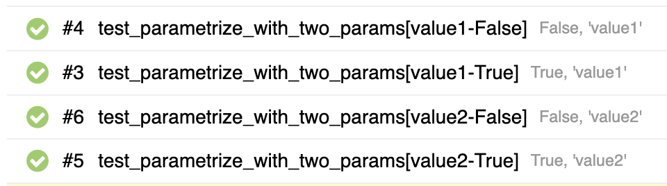
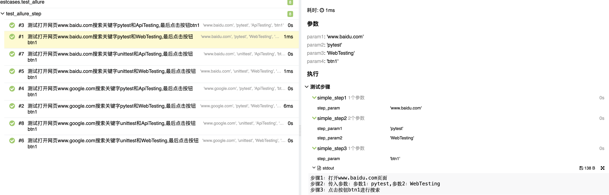
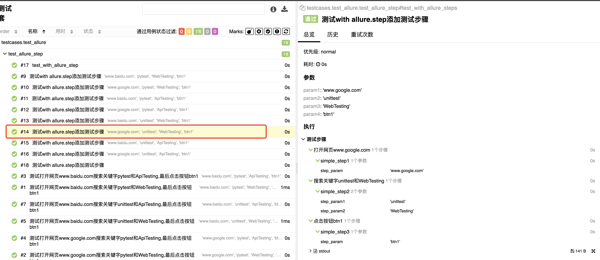

## 一、allure介绍

- allure是多平台的Report框架

- 支持多语言，包括pyhton、javaScript、PHP、Ruby等
- 可以为开发/测试/管理人员提供详尽的测试报告，包括测试类别、测试步骤、日志、图片、视频等。
- 可以为管理层提高高水准的统计报告。
- 可以集成到Jenkins生成在线的趋势汇总报告

## 二、运行方式

### 安装allure、allure-pytest

```bash
brew install allure
pip install allure-pytest
```

### 收集测试数据

pytest 测试模块/测试包/测试用例 --alluredir=指定存储测试结果的路径

```bash
pytest --alluredir=./reports --clean-alluredir

--alluredir=./reports  表示产生的json数据保存在./reports目录下
--clean-alluredir      表示每次执行测试时都先清空文件夹
```

## 三、allure报告的生成

### 1. 在线报告，直接打开默认浏览器展示当前报告

生成在线的测试报告 

```bash
allure serve ./reports
```

### 2. 静态资源文件报告

（带index.html、Css、js等文件），需要将报告布置到web服务器上

将测试报告生成到指定的目录

```bash
allure generate ./results --clean -o ./reports

--clean 每次生成前都先清理./reports目录
./results 测试数据存放目录
./reports allure生成的测试报告存放目录
```

## 四、allure中装饰器

### 1.给测试报告添加用例标题

@allure.title

#### a. 直接食用@allure.title为测试用例自定义标题

```python
@allure.title("身份验证")
def test_authentication():
    assert 1 == 1
    print("身份验证成功")
```

#### b.@allure.title支持通过占位符的方式传递参数，可以实现测试用例标题参数化，动态生成测试用标题。

```python
@allure.title("参数化标题 参数P1:{p1},参数p2:{p2},参数p3:{p3}")
@pytest.mark.parametrize("p1,p2,p3",[[1,2,3],[2,3,5]])
def test_param_title(p1,p2,p3):
    asster p1+p2 == p3
```

#### c.allure.dynamic.title动态更新测试用例标题

```python
@allure.title("原始标题")
@pytest.mark.parametrize("p1",["参数化标题1","参数化标题2","参数化标题3"])
def test_dynamic_param_title(p1):
    assert True
    allure.dynamic.title(p1)
```

#### d. 直接在函数中使用注释添加标题

```python
def test_dynamic_param_title():
    """啊啊啊"""
    assert True
    allure.dynamic.title()
```

### 2.allure报告中添加用例步骤

应用场景：编写自动化测试用例时会遇到需要编写**流程性测试用例**的场景，一般流程性的测试用例的测试步骤比较多，在测试用例中添加详细的步骤会**提高测试用例的可阅读性**。

#### a.使用装饰器定义一个测试步骤，在测试用例中使用。

```python
# -*- coding: utf-8 -*-
# @Time    : 2024/3/26 22:36
# @Author  : heyuyang 
# @Project : PyTestProject 
# @File    : test_allure_step.py
# @Desc    : 在allure报告中添加用例步骤

import allure
import pytest


@allure.step
def simple_step1(step_param1, step_param2=None):
    """定义一个测试步骤step1"""
    print(f"步骤1：打开页面,参数1：{step_param1},参数2：{step_param2}")


@allure.step
def simple_step2(step_param):
    """定义一个另测试步骤"""
    print(f"步骤1：完成搜索{step_param}功能")


@allure.title("测试参数化")
@pytest.mark.parametrize("param1", ["pytest", "allure"], ids=["search pytest", "search pytest"])
def test_parametrize_wth_id(param1):
    allure.dynamic.title(f"step 测试参数化：{param1}")
    simple_step2(param1)

```

```python
# 执行顺序："True,value1", "False,value1", "True,value2", "False,value2" 可知先执行param2在执行param1
@pytest.mark.parametrize("param1", [True, False])
@pytest.mark.parametrize("param2", ["value1", "value2"])
def test_parametrize_with_two_params(param1, param2):
    """测试step传入两个参数"""
    simple_step1(param1, param2)
```



```python
@allure.title("测试不止一个步骤")
@pytest.mark.parametrize("param2", ["pytest", "unittest"])
@pytest.mark.parametrize("param1,param3", [[1, 2]])
def test_parametrize_with_uneven_value_sets(param1, param2, param3):
    simple_step1(param1, param2)
    simple_step2(param3)
```

```python
@allure.step
def simple_step1(step_param):
    """定义一个测试步骤step1"""
    print(f"步骤1：打开{step_param}页面")


@allure.step
def simple_step2(step_param1, step_param2=None):
    """定义一个测试步骤step2"""
    print(f"步骤2：传入参数：参数1：{step_param1},参数2：{step_param2}")


@allure.step
def simple_step3(step_param):
    """定义一个测试步骤step3"""
    print(f"步骤3：点击按钮{step_param}进行搜索")


@allure.title("测试打开网页{param1}搜索关键字{param2}和{param3},最后点击按钮{param4}")
@pytest.mark.parametrize("param1", ["www.baidu.com", "www.google.com"])
@pytest.mark.parametrize(("param2", "param3"), [["pytest", "WebTesting"], ["pytest", "ApiTesting"],
                                                ["unittest", "WebTesting"], ["unittest", "ApiTesting"]])
@pytest.mark.parametrize("param4", ["btn1"])
def test_three_steps(param1, param2, param3, param4):
    simple_step1(param1)
    simple_step2(param2, param3)
    simple_step3(param4)
```



#### b.使用with allure.step()添加测试步骤。

```python
@allure.title("测试with allure.step添加测试步骤")
@pytest.mark.parametrize("param1", ["www.baidu.com", "www.google.com"])
@pytest.mark.parametrize(("param2", "param3"), [["pytest", "WebTesting"], ["pytest", "ApiTesting"],
                                                ["unittest", "WebTesting"], ["unittest", "ApiTesting"]])
@pytest.mark.parametrize("param4", ["btn1"])
def test_with_allure_steps(param1, param2, param3, param4):
    with allure.step(f"打开网页{param1}"):
        simple_step1(param1)
    with allure.step(f"搜索关键字{param2}和{param3}"):
        simple_step2(param2, param3)
    with allure.step(f"点击按钮{param4}"):
        simple_step3(param4)
```



```python
def test_with_allure_step():
    param1 = "www.baidu.com"
    param2 = "pytest"
    param3 = "WebTesting"
    param4 = "btn1"
    with allure.step(f"打开网页{param1}"):
        assert 1 == 1
    with allure.step(f"搜索关键字{param2}和{param3}"):
        assert 1 == 1
    with allure.step(f"点击按钮{param4}"):
        assert 1 == 1
 
@allure.title("测试with allure.step添加测试步骤")
def test_with_allure_step2():
    param1 = "www.google.com"
    param2 = "unittest"
    param3 = "ApiTesting"
    param4 = "btn2"
    with allure.step(f"打开网页{param1}"):
        assert 1 == 1
        print(f"步骤1：打开{param1}页面")
    with allure.step(f"搜索关键字{param2}和{param3}"):
        assert 1 == 1
        print(f"步骤2：传入参数：参数1：{param2},参数2：{param3}")
    with allure.step(f"点击按钮{param4}"):
        assert 1 == 1
        print(f"步骤3：点击按钮{param4}进行搜索")
```

### 3.allure报告中添加用例连接

应用场景：将报告与bug管理系统或测试用例管理系统集成，可以添加连接装饰器@allure.link、@allure.issue和@allure.testcase。

#### a. @allure.link(ur, name)，添加一个普通的link连接，name:起别名

#### b. @allure.testcase(url, name)，添加一个用例管理系统链接。

#### c. @allure.issue(url, name)，添加bug管理系统链接

### 4.allure报告中添加用例分类

应用场景：可以为项目、项目下的不同模块及用例分类管理。也可以运行某个类别下的用例。

报告展示：类别会展示在测试报告的Behaviors栏目下。

#### a. 

#### b.

#### c.

### 5. allure报告中添加用例描述

应用场景：Allure支持往测试报告中对测试用例添加非常详细的描述语，用来描述测试用例详情

#### a. @allure.description() 传递一个字符串参数来描述测试用例。

#### b. @allure.description_html() 传递一段HTML文本来描述测试用例。

#### c. 直接在测试用例方法中通过编写文档注释的方法来添加描述。会按照给定的格式展示，不需要添加\<br/>

### 6. allure报告中添加用例优先级

**应用场景：用例执行时，希望按照严重级别执行测试用例。**

解决：可以为每个用例添加一个等级的装饰器，用法allure.severity

Allure对严重级别的定义分为5个级别：

- Blocker级别：中断缺陷(客户端程序无响应，无法执行下一步操作)
- Critical级别：临界缺陷（功能点缺失）
- Normal级别：普通缺陷（数值计算错误）
- Minor级别：次要缺陷（界面错误与UI需求不符）
- Trivial级别：轻微缺陷（必输项无提示，或者提示不规范。）

### 7. allure报告中添加用例支持tags标签

allure报告支持的一些常见Pytest特性包括xfail、skipif、fixture等。

测试结果会展示特定的标识在用例详情页面

### 8. allure报告中添加pytest.fixture

**应用场景:fixture和finalizer是分别在测试开始之前和测试结束之后由Pytest调用的实用程序函数。Allure跟踪每个fixture的调用，并详细显示调用了哪些方法以及哪些参数，从而保持了调用的正确顺序。**

## 五、失败用例重试功能

allure可以收集用例运行期间，重试的用例的结果，以及这段时间重试的历史记录。

```
pip install pytest.rerunfailures
```

## 六、allure报告中添加附件

### 1. 添加图片

**应用场景:在做UI自动化测试时，可以将页面截图，或者出错的页面进行截图，将截图添加到测试报告中展示，辅助定位问题。**

解决方案: 使用allure.attch或者allure.attch.file() 添加图片。

```python

```

### 2. 添加日志

**应用场景:报告中添加详细的日志信息，有助于分析定位问题。**
**解决方案:使用python自带的logging模块生成日志，日志会自动添加到测试报告中。**