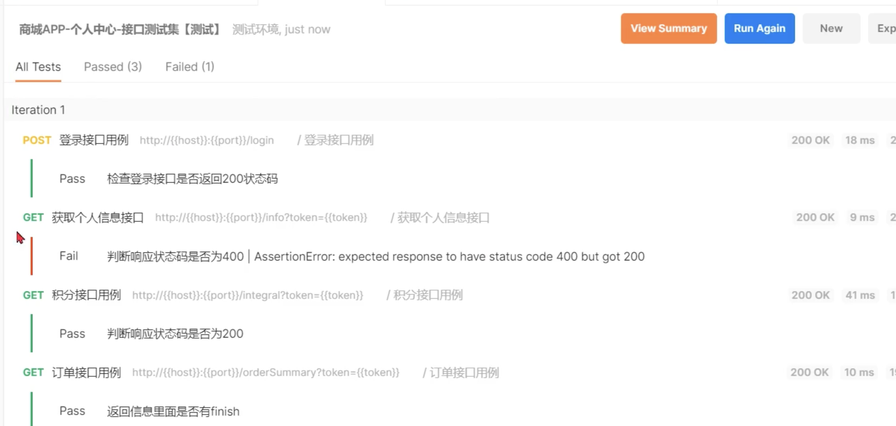
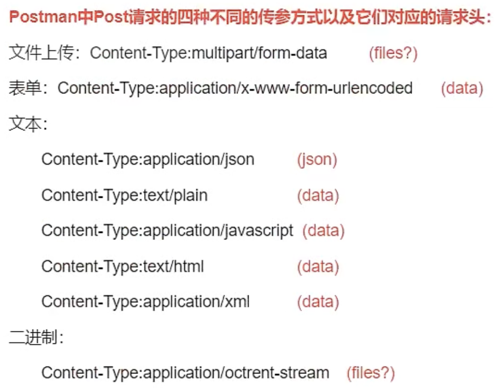

[toc]

## 0. 接口测试

1. 接口 是服务提供方开放的入口和桥梁
   - 登录接口
   - 获取个人信息接口
   - 获取积分信息接口
   - 获取订单汇总接口
2. 网络接口 调用/连接的方式为网络
3. Http接口 基于tcp/ip网络，采取Http作为具体的应用层协议，传输特定格式的数据。 

### 0.1. 接口测试的定义

用于检测外部系统与系统之间，以及内部各个子系统之间的交互点。
接口测试的重点包括交互的数据、过程以及背后的业务逻辑。

### 0.2. 测试步骤

1. 确定接口url
2. 查看接口使用什么方法发送(get/post/put/delete..)
3. 添加请求头，请求参数
4. 发送查看返回结果，校验返回结果是否正确

### 0.3. 使用Postman进行接口测试

- Postman提供了丰富的变量支持，在$\color{red}Postman$中定义了5种不同作用范围的变量类型。

  1. Global变量，可以在Postman工具中所有可以使用变量的地方生效。
  2. Collection变量就是作用与在Collection伤的变量类型。只在设置变量的Collection上生效。
  3. Environment变量，区分不同的环境。
  4. data变量只能在Postman Runner中使用。 就是会在Runner运行时才生效。
  5. Local变量在Postman官方文档中没有给出明确的定义。可以理解成Postman脚本中支持的JS变量，作用域只会在脚本中生效。

- 通过Postman的脚本功能,$\color{red}动态设置变量$

  1. test脚本
     登录成功后，将返回的token值设置为collection范围内的变量。
     后续请求中，token内容，采用变量形式。

      ```javascript
     pm.test("检查登录结果", function () {
         // 校验状态码
         pm.response.to.have.status(200);
         
         var jsonResult = pm.response.json();
         // 将json结果中的token，设置到collection变量
         pm.environment.set("token", jsonData.data);
     });
      ```

  2. Runner 是Postman中用于$\color{red}批量执行$
     最终效果： 每次测试点击一次按钮 自动完成
     

  3. postman --> 新工具newman[命令方式执行] --> 自动生成 测试报告  --> 发邮件

  **自动化：** 借助软件/硬件、编程语言、减少 人工    

## 1. 主流接口测试工具实现接口自动化

### 1. 1.  主流接口测试工具实现接口自动化

**（适用于中小型公司或项目）**

Postman + Newman + Git/Svn+Jekins （基于JavaScript）接口自动化

Jmeter + Ant + Git/Svn + Jekins （基于java和BeanShell）接口自动化

### 1.2.  基于代码的接口自动化

 **(中大型公司)**

Python + Requests + Yaml + Pytest + Allure + logging + 热加载 + Jekins持续集成接口自动化

### 3. 基于平台的接口自动化

**（特大型或外包）**

测试开发

## 2. Requests模块以及常用的方法和底层原理

2.1. 用于发送http请求以及接口http响应的python的第三方库

    ```python
    def get(url, params=None, **kwargs):
        return request("get", url, params=params, **kwargs)
    
    def post(url, data=None, json=None, **kwargs):
    def put(url, data=None, **kwargs):
    def delete(url, **kwargs):
    def patch(url, data=None, **kwargs):
    
    def request(method, url, **kwargs):  # 上述方法都是最终调用该方法
        with sessions.Session() as session:
            return session.request(method=method, url=url, **kwargs)
    def session():  # 会话 web项目中从登录和退出就是一个会话。
        return Session()
    ```

2.2. post请求中data传参和json传参的本质：



2.3. ==**解析requests底层原理**==

    ```
    param method:  ``GET``, ``OPTIONS``, ``HEAD``, ``POST``, ``PUT``, ``PATCH``, or ``DELETE``.
    :param url: 请求url
    :param params: get请求传参
    :param data: Post或Put传参
    :param json: Post传参
    :param headers=None: 请求头
    :param cookies=None: Cookie信息
    :param files=None: 文件上传
    ===========================================
    :param auth: 鉴权
    :param timeout: 超时处理
    :param allow_redirects: 是否允许重定向 
    :param proxies: 代理
    :param hooks=None: 钩子
    :param verify: 验证证书
    :param stream: 文件下载
    :param cert:  CA证书
    ```

2.4. Response对象

    ```
    res.text 返回文本格式
    res.content 返回bytes类型数据
    res.json() 返回json数据
    res.status_code 返回状态码
    res.reason 返回状态信息
    res.cookies 返回cookie信息
    res.encoding 返回编码格式 
    ```

## 3. Python接口自动化测试流程和框架封装

### 1. 接口自动化测试的流程

1. 接口文档(openapi)
2. 编写接口请求代码
3. 设计测试用例，调用请求代码
4. 封装成框架
   1. 用例管理
   2. 用例筛选
   3. 前后置自动执行
   4. 使用其他库类
   5. 生成测试报告

### 2. 请求代码

### 3. 设计测试用例

#### 1.schema验证

1. 请求的格式
2. 响应的格式

#### 2.参数验证

#### 3.业务流程

1. 正向用例
2. 反向用例

#### 4.安全测试

#### 5.性能测试

### 4.封装框架

凝聚多个项目的共同之处

一般基于已有的、成熟的框架来进行封装： pytest

#### 1. 框架的顶层设计

1. 输入
   - 用例 yaml excel json python key_word
     - 手动编写
     - 自动生成
   - 配置文件 ini json yaml
2. 执行
   - 日志
   - 分组
   - 等待
   - 失败重试
3. 输出
   1. 邮件
   2. html

#### 2. 读取用例

```yaml
api:
  url: localhost:8000/login/
  method: post
  headers:
    Content-Type: application/json
case:
  - - "username=abc&password=def"
    - 400
  - ["username=hyy&password=123", 400]
  - ["username=daxinzang&password=123456", 200]
  - ["username111=hyy&password=123456", 422]
```

```python
import yaml
import requests
from functools import partial


session = requests.Session()
with open("test_api.yaml") as f:
    cases = yaml.safe_load(f)
    
api = partial(session.request, **case['api']) # 生成可调用的api

for case in cases["case"]:
    response = api(data=case[0])
    assert response.status_code == case[1]
```

#### 3.执行用例

用例管理，用例之间进行隔离

框架读取多个yaml文件，根据yaml执行多个测试用例

> libs.py

```python
import yaml
import requests
from functools import partial

session = requests.Session()

class ApiBaseCase:
    case_path = None
    def test_(self):
        with open(cls.case_path) as f:
            self.test_case = yaml.safe_load(f)
        api = partial(session.request, **self.test_case["api"])
        fail = list()
        for case in self.test_case['case']:
            try:
                print("执行用例: ", case[0])
                response = api(data = case[0])
                assert response.status_code == case[1]
            except AssertionError:
                fail.append(case[0])
         assert len(fail) == 0, f"以下用例执行失败 {fail}"
```

> test_api.py

```python
from libs import ApiBaseCase

class TestLLoginCase(ApiBaseCase):
    case_path = "test_api.yaml"

class TestTokenCase(ApiBaseCase):
    case_path = "test_token.yaml"
```

#### 4.生成测试报告

pytest-html

allure
