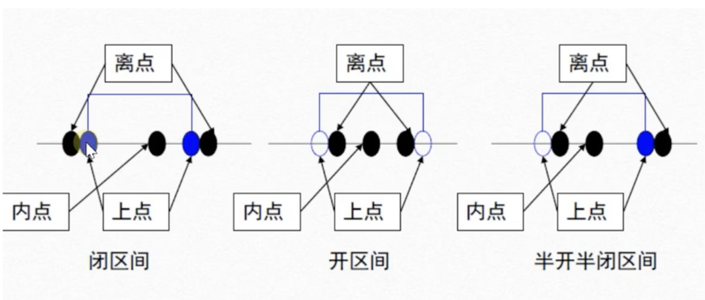
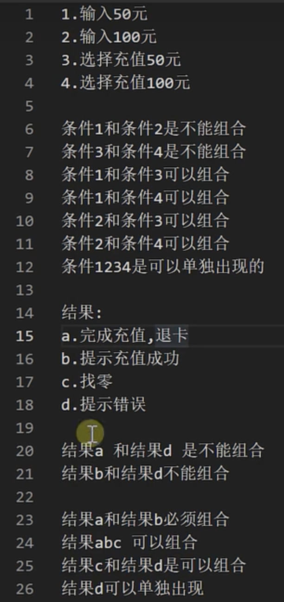
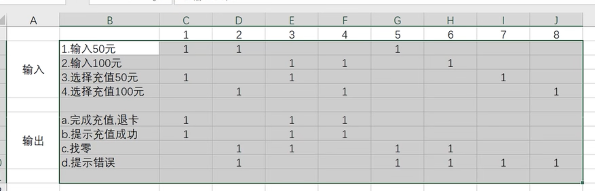

## 软件测试

### $\color{red}所有自动化的最终目标:无人值守测试$

### $\color{red}所有的测试执行(计算机完成) --发版--回退--部署--监控--预警$

### 定义

> 使用人工或自动的手段来运行或者测试某个系统的过程

### 目的：

- 以最小的人力、物力和时间找出软件中潜在的错误和缺陷

1. 检验产品是否满足规定的需求；弄清**$\color{red}预期结果$和$\color{red}实际结果$**的差别
2. 为了提高用户的体验
3. 为了发现程序中存在代码或业务逻辑的错误

## 软件测试原则

- 证明软件中存在缺陷
- **不能穷尽测试**
- 测试应该尽早介入
- 28原则
- 不存在缺陷谬论
- 妥善保存一切文档

## 软件测试基本要求

1. 外观界面测试
2. 易用性测试
3. 兼容性测试
4. 安全性测试
5. 性能测试
6. 功能测试 功能是否正常运行

## 软件测试的工作流程

> 需求分析--->需求评审--->编写测试计划--->测试计划评审--->提取测试点--->设计测试用例--->测试用例评审--->搭建测试环境--->冒烟测试--->执行测试用例--->bug跟踪处理--->测试报告

1. 需求分析

   阅读需求文档 产品文档 产品详细设计说明书 分析需求的点 参数需求评审

   快速熟悉项目 

2. 测试计划和测试方案

   测试计划：测试整个项目的总体的规划

   测试的范围，进度的安排 人力物力的安排 整体的测试策略 风险的评估 风险的规避 5w 1h why when who  what where

   测试方案  how 

   被测试的目标 选取什么样的测试工具 测试的方法 测试的重点

3. 测试用例设计

   边界值  等价类。。。

4. 测试用例执行

5. 评估阶段 测试报告

## 软件开发过程模型

1. #### 瀑布模型

   **文档驱动**，遵守这个约束可使软件维护变得比较容易一些，从而显著降低软件预算。

   1. 流程

      > 需求分析-->设计-->编码-->实现-->软件测试-->完成-->维护

   2. 测试的切入点

      > 测试阶段处于软件实现后，必须在代码完成后留出足够的测试时间，否则将导致测试不充分，很多问题到项目后期才会暴露

   3. 优缺点

      > 优点： 开发的各个阶段比较清晰；
      >
      > ​             强调早起计划和需求调查；
      >
      > ​              适合需求稳定的产品开发。
      >
      > ​              可在迭代模型中应用瀑布模型
      >
      > 缺点： 依赖早期的需求调查，不适应需求的变化；
      >
      > ​             不适合需求模糊或者需求经常变动的系统
      >
      > ​             单一流程不可逆；
      >
      > ​             风险往往在后期才会显露，失去及早纠正的机会，影响后面的阶段，可能会导致项目失败。

2. #### V模型

   1. 流程

      > 需求分析(验收测试)--->概要设计(系统测试)--->详细设计(集成测试)--->编码(单元测试)

     2. 优缺点

        > 优点： 每一个阶段都清晰明了，便于控制开发的每一个过程，既包含单元测试又包含系统测试
        >
        > 缺点：测试介入的较晚，对于前期的一些缺陷无法发现和修改，测试和开发传行，总用时较长。

3. #### W模型

   测试伴随整个软件开发周期，并且测试的对象不仅仅是程序，需求和设计同样要测试。

   1. 流程

      > 需求分析(验收/系统测试设计)--->概要设计(集成测试设计)--->详细设计(单元测试设计)--->编码(单元测试)--->集成(集成测试)--->实施(系统测试)--->交付(验收测试)

     2. 优缺点
   
        1. 优点：测试伴随软件的整个生命周期。
        2. 缺点：
           1. 依赖于软件开发和软件测试，依然保持一前一后的线性关系，无法支持迭代、自发性和需求等变更调整；
           2. 对于当前很多项目，在执行的过程中根本不产生文档，那么W模型基本无法适用；
           3. 使用起来技术复杂度很高，对于需求和设计的测试要求很高，实践起来困难。适用于大中型企业。

4. 螺旋开发模型

   1. 流程

      > 制定计划(决定目标、方案和限制)--->风险分析(评价方案、识别风险、消除风险)--->实施工程(开发、验证下一代产品)--->客户评估
      >
      > 制定计划-分线分析-原型-软件需求-需求确认-开发计划-评审

5. 敏捷开发模型

   简单设计，快速实现、根据用户需求迭代

6. 迭代开发模型

   先开发小版本 之后逐渐增加功能

## 测试与开发的关系

- 目标相同
  - 都是为了制造出高质量的软件
- 相辅相成 
  - 开发经验对测试有用，测试经验对开发有用
- 侧重点不同：
  - 开发偏向于从无到有的业务逻辑
  - 测试偏移想保证从有到优的业务稳定性
  - 思维定势、测试力度、关注度

## 软件测试分类

### 1. 按测试阶段划分

#### 单元测试

- 编码完成前或后，写完一个方法、函数、类、模块后验证

- 开发人员、白盒测试人员

#### 集成测试

- 单元测试完成之后

- 模块完成编码之后

- 模块和模块之间的测试

- 开发人员、白盒测试人员

#### 系统测试

- 集成测试完成之后

- 程序、软件、app系统

- 整体测试

- 开发、白盒测试、黑盒测试

#### 验收测试（交付测试）

- 系统测试之后

- 整个的系统

### 2. 按是否覆盖源代码划分

#### 白盒测试： 

- 针对代码去测试，覆盖源码

- 语句覆盖

  确保代码里的每一个语句都会被测到

- 判断覆盖

  确保代码里的每一个判断都会被测到

- 条件覆盖

  确保代码里的每一个条件都会被测到

- 路径覆盖

  确保代码里每一个分支都会走到

#### 黑盒测试：

针对功能区测试，完全不关心源码，只关注输入和输出

##### 功能测试

不关心代码怎么实现，只关心有没有问题

- UI(界面)测试
- 业务(功能)测试
- 文档测试
  - 逻辑是否清晰
  - 语言描述是否清晰
  - 引导误导功能
- 易用性测试
- 安装和卸载测试
- 兼容性测试
  - 浏览器测试
  - 平台测试
  - 本身的兼容性
  - 其他的软件的兼容性
  - 数据兼容

##### 性能测试

- 一般性能测试
  - 响应速度
  - 对资源的利用
- 稳定性测试
- 负载测试
- 压力测试

#### 灰盒测试

关心输入、输出，考虑程序运行的状态

### 3. 按是否运行划分

- 静态测试： 测需求文档、界面等不运行测试
  - 测试程序的机构
  - 程序过程
  - 接口是否正常
  - 代码的风格是否符合标准
- 动态测试 ：程序运行中测试

### 4. 其他分类

#### 回归测试

测出问题后，打回去让开发人员修改，开发人员修改提交之后，再进行测试

对软件的既有功能进行验证，以**确保新的开发、修复或修改**不会对软件的**现有功能产生负面影响**

#### 冒烟测试 

开发完成程序之后对程序的主流程(基本功能)进行测试，不测程序的细节

**基本功能基本模块**能否正常运行

#### 随机测试 

monkey测试

- 模拟猴子进行测试，随机位置自由测试

又叫探测性测试，选取重要的功能模块进行测试

#### 验收测试 

- $\alpha$ 测试  是内测版本，公司内部测试
- $\beta$测试：是公测版本，客户测试
- $\gamma$测试：指的是软件版本正式发行的候选版

### 5. 按是否自动化划分

1. 手工测试
2. 自动化测试

## 测试用例

### 定义

test case 是为某个特殊目标而编制的一组==**测试输入**，**执行条件以及预期结果**==，以便测试某个程序路径或核实是否满足某个特定需求。

### 测试用例的特性

有效性

- 测试用例的能够被使用，且被不同人员使用测试**结果一致**。

可复用性

- 良好的测试用例具有重复使用的功能，如：回归测试

易组织性

- 好的测试用例会分门别类地提供给测试人员参考和使用

可评估性

- 从测试管理的角度，测试用例的通过率和软件缺陷的数目是软件产品质量好坏的测试标准。

可管理性

- 从测试管理的角度，测试用例的通过率和软件缺陷的数目是软件产品质量好坏的测试标准。

### 测试用例的要素

| 测试用例编号 | 测试项目(测试模块) | 预置（前提条件）条件 | 测试输入 | 预期输出 | 操作步骤       | 测试用例标题         | 级别 |
| :----------- | ------------------ | -------------------- | -------- | -------- | -------------- | -------------------- | ---- |
| ST-子项名-01 | 用户登录           | 邮箱正常使用         | 邮箱     | 正常登录 | 输入邮箱并确认 | 测试能否邮箱登录成功 | 重要 |

测试用例八大要素

1. 测试用例编号

   编号由字符和数字组合成的字符串，用例编号具有**唯一性、容易识别**

2. 测试项目/模块

   测试的模块输入那个项目或者被测试的需求、被测的模块、被测的单元等等

3. 预置条件

   **执行当前测试用例需要的前提条件**，如果前提条件不满足，则后面的测试步骤不能进行或者得不到预期结果

4. 测试输入

   测试用例执行过程中需要加工的外部信息。根据测试用例的具体条件有手工输入、数据库等

5. 预期输出

   测试用例的预期输出结果，包括**返回值内容，界面相应结果**等

   预期结果来源：分析需求文档，根据需求写

6. 操作步骤

   执行当前测试用例需要经过的操作步骤，需要**明确的给出一个步骤的描述**，测试用例执行人员可以根据该步骤完成测试用例执行

7. 测试用例标题

   对测试用例的简单描述。用概括性的语言描述该测试用例的测试点。每个测试用例的标题不能够重复，因为每个测试用例的测试点是不一样的。

8. 级别

   对于测试用例的重要程度的区分，包含如下几种：

   - 高级别：保证系统基本功能、核心业务、重要特性、实际使用频率比较高的用例
   - 中级别：重要程度介于高和低之间的测试用例
   - 低级别：实际使用的频率不高，对系统业务功能影响不大的模块或功能的测试用例

9. 其他要素
   - 用例的设计者：能够准确找到测试用例的设计人员，对用例修改时能方便找到人员。
   - 用例设计日期：方便检查用例的设计进度。
   - 对应的开发人员：出现bug 后能及时找到对应的人员进行修复 ==必写==
   - 测试结果：执行用例最后执行的结果，包括pass、fail、block  ==必写==
   - 测试类型：功能、性能、压力等
   - 测试版本：

### 测试用例的设计原则

- 明确性

  测试人员要尽量避免测试用例存在含糊的因素，在测试过程中，测试用例的测试结果是唯一的。

- 代表性

  尽量将具有相似功能的测试用例抽象合并，功能相似的用例要合并。

- 简洁性

  测试用例简洁，可读性良好，测试过程目的明确，测试结果唯一。测试用例要用陈述性语句 一句话直指问题的核心，不要使用浮夸的修饰手法。

**测试用例要素是为了便于快速的设计测试用例，因此要掌握最常用的八大要素，之后灵活添加其他测试的元素**

### 测试用例设计方法

#### 等价类

- 是把**所有可能的输入数据**，即程序的输入域划**分成若干部分**，然后从每一部分中选取**少数具有代表性的数据**作为**测试**用例。使用等价类划分方法设计测试用例要经历==**划分等价类(列出等价类表)**==和==**选取测试用例**==两步。它将不能穷举的测试过程进行**合理分类**，从而保证设计出来的测试用例具有==**完整性和代表性**==。

- 是指某个输入域的子集合。在该子集合中，各个输入数据对于揭露程序中的错误都是等效的，具有等价特性。

$\color{red}理想的测试是：用最少的测试数据，达到最好的测试质量$

**合理假设**

- 测试某价类的代表值就等于对这一类其它值的测试。

##### 1. 有效等价类

指对**程序的规格说明**来说是==合理的、有意义的输入数据构成的集合==。利用有效等价类可以检验程序是否实现了规格说明中所规定的功能和性能。

##### 2. 无效等价类

是指对**程序的规格说明**是==不合理的、无意义的输入数据所构成的集合==。对于具体的问题，无效等价类**至少有应有一个，也可能有多个**。利用无效等价类可校验程序对于无效数据的处理能力，检测程序的健壮性、容错能力。

> 设计测试用例时，要同时考虑这两种等价类。因为软件不仅要能接收合理的数据，也要能经受意外的考验，这样的测试才能确保软件具有更高的可靠性。

##### 案例

qq登录  6-10位的qq 包括6位  包括10位

必须是整数数字 不能以0开头

- 等价类划分

  - 有效等价类
    - 6位 7位 8位 9位 10位 (不以0开头)

  - 无效等价类 （没在设计需求内，都可以理解为无效等价类）
    - 6位 7位 8位 9位 10位 (以0开头)
    - 小数 字母 特殊字符 *&_? 汉字 
    - 数字、小数、字母、特殊字符、汉字的组合
  - 编写测试用例

#### 边界值

**大量的错误是发现在输入或输出范围的边界上**，而不是发生在输入输出范围的内部

1. 概念：边界值分析法是作为对等价类划分法的补充，对输入或输出的边界值进行测试

2. 与等价类的区别：
   1. 边界值分析不是从某等价类中随便挑一个作为代表，而是使这个等价类的每个边界都要作为测试条件；
   2. 边界值分析不仅考虑输入条件，还要考虑输出空间产生的测试情况。

3. 常见的边界值

   

#### 因果图法

**定义**

是一种利用图解法分析**输入**的**各种组合**情况，从而设计测试用例的方法，适合于检查程序输入条件的各种组合情况

**特点**

- 考虑输入条件的相互制约及组合关系
- 考虑输出条件对输入条件的依赖关系

##### 核心

因果图法比较适合输入条件比较多的情况，测试所有的输入条件的排列组合，所谓的原因就是输入，所谓的结果就是输出。‘因’=输入条件“果”=输出结果

##### 主要考虑内容

1. 所有输入/输出itoa见的相互制约关系以及组合关系
2. 输入条件的依赖关系，也就是什么样的输入组合会产生什么样 的输出结果，即“因果关系”

##### 符号

1. 恒等  若原因出现，则结果出现；若原因不出现，则结果也不出现
2. 非(~)  若原因出现，则结果不出现；若原因不出现，则结果出现
3. 或(V)  若几个原因中有一个及以上出现，则结果出现；若几个原因都不出现，则结果不出现
4. 与      若其中一个原因不出现，则结果不出现。

##### 因果图法步骤

1. 找出所有的原因，原因即输入条件或输入条件的等价类
2. 找出所有的结果，结果即输出条件
3. 明去所有输入条件之间的制约关系以及组合关系，哪些条件不能组合到一起，哪些条件可以组合到一起
4. 明确所有输出条件之间的制约关系以及组合关系，哪些输出结果不能同时输出，哪些输出结果可以同时输出
5. 找出什么样的输入条件组合会产生哪种输出结果。
6. 把因果图转换成判定表/决策表。
7. 为判定表/决策表中的每一列表示的情况设计测试用例。

##### 案例

系统需求

- 系统只接收50或100元纸币，一次只能使用一张纸币，一次充值金额只能为50元或100元；
- 若输入50元纸币，并选择充值50元，完成充值后退卡，提示充值成功；
- 若输入50元纸币，并选择充值100元，提示输入金额不足，并退回50元；
- 若输入100元纸币，并选择充值50元，完成充值后退卡，提示充值成功，找零50元；
- 若输入100元纸币，并选择充值100元，完成充值后退卡，提示充值成功；
- 若输入纸币后在规定时间内不选择充值按钮，退回输入的纸币，并提示错误；
- 若选择充值按钮后不输入纸币，提示错误

实现步骤：

> https://blog.csdn.net/weixin_43090420/article/details/90608526

#### 场景法

从起点，通过一系列操作步骤(事件)，达成某一结果，到终点的过程测试。场景法主要用于**冒烟测试**。

1. 场景法是模拟用户操作软件时的场景，主要用于测试系统的业务流程；
2. 当拿到一个测试任务后，先关注它的主要功能和业务流程是否正确实现，这就需要用到场景法来完成测试。当业务流程或者说该软件的主要功能没有问题时，我们再重点从边界值、等价类等方面对控件进行更加细致。完整的测试。
3. 冒烟测试主要采用场景法进行测试。

#### 错误推断法

1. 错误推断法是指利**用直觉和经验**猜测出会出错的可能类型，有**针对性的**列举出程序中所有可能的错误和容易发生错误的情况。
2. 不单独使用，可以作为其他方法的补充。
3. 使用场景： 适用于项目时间比较短，任务比较繁重的情况下，而且测试经验比较多。

#### 测试用例的力度

- 简单

  仅仅是测试的纲要，可能包含测试的内容。简单的测试用例其实并没有进行“设计”，而仅仅是记录。

- 复杂

  包含具体的输入项、每一个步骤、期待的结果。

- 中庸

  过于简单，会导致测试有遗漏，而且根据测试执行人员的水平不同导致偏差较大。过于复杂、会导致效率过低，维护成本较高，限制测试人员的思维， 一般在工作中都介于两者之间。

#### 测试用例设计方法总结

- 测试用例的本质(基于需求)

  - 理解需求  反映需求  忠于需求

  - 需求会变化，则测试用例也应该是活的、变化的

    $\color{red}“及时响应变更比遵循计划更有价值”$

- 原则

  1. 根据程序的重要性和一旦发生故障带来的损失，来确定测试等级和测试重点
  2. 认真选择测试策略。$\color{red}用尽可能少的测试用例来发现尽可能多的错误$。测试用例不足会导致风险的增大；测试过度导致资源的浪费。需要找到平衡点。

- 方法选取

  1. 先关注**主要功能 业务流程、业务逻辑**是否正确实现，考虑**场景法**
  2. 需要**输入数据**的地方，考虑**等价类划分法**
  3. 在任何情况下都使用**边界值法**
  4. 如果程序的功能中包含**输入条件的组合**情况，则选取**因果图和判定表法**
  5. 对于配置类软件，需要考虑**参数的组合**情况，考虑使用**正交排列法**
  6. 对照**程序逻辑**，如果发现**没有达到要求的覆盖标准**。适当补充更多的测试用例
  7. 采用错误推断法，追加其他测试用例。

### 测试用例设计步骤

1. 确定需求
2. 确定有效等价类和无效等价类
3. 对每条等价类设计测试用例

### 测试用例的评审

- 同行评审

  “个体和交互比过程和工具更有价值”

  由测试小组内部进行相互评审，达到思想的碰撞，通过探讨、协作完成测试用例的设计

- 用户评审

  “顾客的协作比合同谈判更有价值”

  - 如果测试是对产品的批判，则顾客指最终用户或者顾客代表

    在公司内部可以是市场调查人员或者相关领域专家

  - 如果测试是为软件开发提供帮助和支持，那么顾客就是程序员

## 缺陷

- 定义
  - 从内部看，软件缺陷是产品**开发或者维护过程中存在的错误、毛病**等各种问题
  - 从外部看，软件缺陷是系统所需要实现的某种功能的**失效或者违背**
  - 总的来说，缺陷就是问题，最终表现为所需要的功能**没有完全实现，没有满足用户**的需求。

- 具体包含(程序、数据、文档)
  - 未达到需求规格说明书中的功能
  - 出现了需求规格说明书中指明不会出现的错误
  - 功能超出了需求规格说明书的范围
  - 未达到需求规格说明书中虽然没有指明，但应该达到的目标
  - ==测试人员或者用户认为软件难以理解、不易使用、运行速度慢或者最终用户认为不好==

- 表现形式
  - 功能、特性没有实现或者部分实现
  - 设计不合理，功能特性不明确，逻辑不清楚或者存在矛盾
  - 产品实际结果和所期望的结果不一致
  - 没有达到需求规格说明书所规定的性能指标
  - 运行出错、中断、崩溃、界面混乱
  - 数据不正确、精度不够、不完整，格式不统一
  - 用户不能接受的其他问题，超时、界面丑陋
  - 硬件或者系统软件存在的其他问题

- 缺陷产生的原因

  缺陷不可避免，主要原因如下：

  - 需求解释或者记录错误
  - 用户需求定义错误
  - 需求说明存在错误
  - 编码说明、程序代码有误
  - 硬件或者系统存在错误
  - 文档错误、内容不正确、拼写错误

- 缺陷产生的根源

  - 交流不充分
  - 软件的复杂性
  - 开发任务的错误
  - 需求的变化
  - 进度压力

### 缺陷的状态

| #    | 状态      | 含义                                     |
| ---- | --------- | ---------------------------------------- |
| 1    | new       | 新建，缺陷的初始状态                     |
| 2    | assigned  | 已指派，分配给具体的开发人员             |
| 3    | open      | 打开，开发人员开始修改缺陷               |
| 4    | fixed     | 修复，开发人员修改缺陷完毕               |
| 5    | closed    | 回归测试通过，关闭缺陷                   |
| 6    | reopen    | 回归测试失败，再次打开                   |
| 7    | postpone  | 推迟修改                                 |
| 8    | duplicate | 与已提交的Defect重复                     |
| 9    | reject    | 拒绝修复，可能为测试人员对于需求理解错误 |

- 状态变化

  1. new - 测试人员发现缺陷
  2. assigned - 由开发经理或者其他人员，将修复职责指定为某位开发人员
  3. 开发人员阅读缺陷报告，可能得到如下结果
     - open 测试人员是正确的，准备修复
     - duplicate 与其他bug为同一原因，修正好一个后，这个也就修复了
     - reject 测试人员理解错误，其实这不是bug
     - fixed 经过一段时间开发人员修复了bug，就会标记为此状态
     - postpone 小问题，目前没有时间修复
  4. 测试人员检验缺陷状态
     - closed 再次测试，发现错误已经修复。
     - closed reject的错误，经过沟通核实后，确认无需修复
     - reopen 原来修复后的缺陷，经过回归测试后又出现了，标记原先的缺陷为此状态

- 缺陷跟踪

  

- 要点

  缺陷从测试人员开始，也应该由测试人员结束。

### 缺陷的严重程度

- 严重程度分为五个等级：

  - Fatal 致命的缺陷 造成系统或应用程序**崩溃、死机、系统挂起**、或**造成数据丢失**，**主要功能完全丧失**，导致**本模块以及相关模块异常**等问题。
  - Critical 严重错误的软件缺陷 系统的**主要功能部分丧失**、**数据不能保存**，**系统的次要功能完全丧失**。问题局限在**本模块**，导致模块功能失效或异常退出。如系统资源占用过大、功能没有做完。
  - Major 一般的软件缺陷 **次要功能**没有完全实现但不影响使用。如：提示信息不太准确，或用户界面差，操作时间长，模块功能部分失效等。
  - Minor 较小的软件缺陷 较小错误的软件缺陷，使操作者不方便或遇到麻烦，但它**不影响功能性的操作和执行**。例如：对话框弹出位置，步骤较多，输入项太麻烦。
  - Enhancemental建议问题 由问题提出人对测试对象的改进意见或测试人员提出的建议、质疑。例如：错别字、颜色、按钮大小。

- 说明

  严重程度的分级，并不统一，3个等级或4个等级都是可以的。

### 缺陷的优先级别

| 级别 | 定义     | 说明                                                         |
| ---- | -------- | ------------------------------------------------------------ |
| P1   | 立即解决 | 缺陷导致系统**几乎不能完全运行、使用**，或**严重妨碍测试的执行**，需立即修正，尽快修正 |
| P2   | 高级优先 | 缺陷严重，**影响测试**，需要**优先考虑修正**，如不超过24小时修正； |
| P3   | 正常界别 | 缺陷需要修改，只要**正常排队修复**就可以                     |
| P4   | 低优先级 | 缺陷可以在开发人员有时间的时间修复，若没有时间可以不修复     |

### 缺陷的表现形式

| 分类     | 说明                                                         |
| -------- | ------------------------------------------------------------ |
| 代码问题 | 不满足需求，功能实现错误；对产品或项目质量有影响的bug可统一划入； |
| 设计缺陷 | 页面美观性、协调性、错别字等                                 |
| 用户体验 | 对产品、项目的建议性意见，不强制要求修改                     |
| 性能问题 | 进行性能测试时使用，暂定：网络延时，内存问题，CPU占用、硬盘问题 |
| 安全问题 | 业务功能存在的安全问题                                       |
| 兼容问题 | 在部分环境中表现正常，在部分环境中表现不正常                 |
| 接口问题 | 设计有模块间数据传递时使用                                   |
| 配置问题 | 由于提供的配置不当或者配置不能满足实际要求而出现的问题       |
| 其他问题 | 上述不能归纳进来的                                           |

### 缺陷报告

- 缺陷报告的一些字段及说明

  | 编号 | 属性名称                    | 描述                                                 |
  | ---- | --------------------------- | ---------------------------------------------------- |
  | 1    | 缺陷ID                      | 唯一的缺陷ID，可以根据该ID追踪缺陷                   |
  | 2    | $\color{red}缺陷状态$       | 缺陷状态指缺陷通过一个跟踪修复过程的进展情况         |
  | 3    | $\color{red}缺陷标题$       | 描述缺陷的标题                                       |
  | 4    | $\color{red}缺陷的严重程度$ | 对软件产品的影响程度，分致命、较严重、严重、一般、低 |
  | 5    | $\color{red}缺陷的优先级$   | 缺陷修复的先后顺序，即哪些缺陷优先修正，哪些稍后修正 |
  | 6    | $\color{red}缺陷所属模块$   | 缺陷所属的项目和模块，要能较为精确的定位至模块       |
  | 7    | 缺陷记录者                  | 提交缺陷的人员姓名                                   |
  | 8    | 缺陷提交时间                | 缺陷提交的时间                                       |
  | 9    | 缺陷处理人                  | 处理缺陷的处理人                                     |
  | 10   | 处理结果描述                | 对处理结果的描述，描述处理情况和代码修改说明         |
  | 11   | 缺陷处理时间                | 缺陷处理的时间                                       |
  | 12   | 缺陷验证人                  | 对被处理缺陷验证的验证人(回测者)                     |
  | 13   | 验证结果描述                | 对验证结果的描述(通过/不通过)                        |
  | 14   | $\color{red}缺陷详细描述$   | 缺陷的重现步骤                                       |
  | 15   | 缺陷环境说明                | 对测试环境的描述                                     |
  | 16   | 必要的附件                  | 如涉及到附件的或错误现象的图片等                     |

- 缺陷报告的作用：

  1. 记录测试结果
  2. 方便开发人员进行缺陷的定位
  3. 为后期统计缺陷提供依据

#### 缺陷报告书写规范

- 标题
  - 简短
  - 尽量能够体现 原因和结果
  - 准确： 避免使用模糊不清的词语
  - 便于他人理解，不要使用俚语、方言词汇
- 原则
  - 完整 他人按照步骤、即**可复现问题**
  - 简明不包含夸张、啰嗦的内容
- 内容
  - 测试环境描述
  - 步骤
    - 加上编号
    - 一个步骤不要包含太多步骤
    - 可能将多个步骤合为一个
    - 可以包含该步骤后的一个中间结果
    - 可使用短语或断句，不需要复杂句式
  - 实际结果 清楚，不笼统
  - 期望结果根据需求文档，应该出现的结果
  - 附件 截图、 录屏、 测试中需要的数据
  - 解决方案/可能的原因(非必须) 如果测试人员能够给出解决方案则更好
- 常见错误
  - 人称代词不明确
  - 情绪化语言、强调符号
  - 不确定词汇
  - “幽默”、“梗”
  - 不确定：对于缺陷，测试人员至少需要再次操作，来重现缺陷

在测试后，如果发现缺陷，则应该进行缺陷报告。

#### 缺陷报告的原则和重要性

- 重要性
  - 节省开发和测试人语啊的沟通时间
  - 提高缺陷修复速度
  - 提高测试人员的声誉
  - 加强协同工作
- 原则：
  - 5C原则
    - 准确： 每个组成部分的描述准确不会引起误解。
    - 简洁：只包含必可不少的信息，不**包括任何多余的内容**。
    - 清晰：每个组成部分的描述清晰，易于理解。
    - 完整：包含**复现**该缺陷的完整步骤和其他本质信息。
    - 一致：按照一致的格式书写全部缺陷报告。
  - 一个缺陷一个报告
    - 便于分配 
    - 便于验证

### 缺陷统计

- 通过缺陷统计，可以得出以下信息

  - 缺陷分布：找出系统的薄弱环节
  - 缺陷状态：根据变化，检查测试和开发的工作情况
  - 人员水平：开发人员出错的数量，测试人员测出的数量
  - 比较历史：对人员水平有所把握
  - 模块难度：较难的模块出现问题的可能性较大
  - 修复时间：平均修复缺陷需要的时间，越短越好
  - 未修复的缺陷数目:

- 作用

  - 风险评估：能否在计划内的时间发布
  - 缺陷原因：避免反复出现同类型的缺陷
  - 员工技能提升：根据开发和测试人员表现出来的问题，可有针对性提升
  - 团队配置：根据缺陷修复时间，可知道团队配合强弱

- 指标

  - 单位时间（天/周）内报告的缺陷数目
  - 单位时间（天/周）内修复的缺陷数目
  - 累计缺陷报告数量
  - 累计缺陷修复数量
  - 不同严重性的缺陷数
  - 模块与缺陷的对应关系

- 缺陷密度

  单位 缺陷数量/kloc（kilo lines of code）计算 总缺陷数量/总代码行数 /1000

- 例子

  > https://www.cnblogs.com/yingyingja/p/9803542.html

### 常见缺陷的查找方法

- UI
  - 色彩
  - 大小
  - 布局
  - 图片
  - 字体
- 时间
  - 网络传输
  - 数据未压缩
  - 解析困难
- 文字内容
  - 描述不清
  - 描述不正确
  - 有语病，错别字
  - 太复杂
  - 乱码
- 容错处理
- 性能缺陷
  - 花费时间长
  - 资源占用多
  - 卡顿
  - 并发差
  - 延迟高

### 缺陷的修复

- 不是所有的“缺陷”都是缺陷
  - 无法重现或者难以捕捉
  - 缺陷报告中没有复现步骤
  - 缺陷报告无法理解
  - 极少使用的功能，或者不符合用户习惯，或者惯例
  - 由不受信任的测试人员提出
- 不是所有的缺陷都会修改
  - 上线时间有限制
  - 不正确的操作
  - 涉及模块太多，可能导致按下葫芦浮起瓢的情况
  - 性价比太低
  - 极难重现

## 测试报告

对软件质量做一个评测总结

### 1. 概述

#### 1.1 项目简介

#### 1.2 测试概要

| 项目情况       | Xray焊缝缺陷检测系统_V0.75                                   |
| -------------- | ------------------------------------------------------------ |
| 测试人力       | 3人天(1人*3天)                                               |
| 开始时间       | 2.24.4.15                                                    |
| 测试轮次       | 第一轮                                                       |
| 此时环境与配置 | 操作系统：centos  数据库：Mysql8.0  数据库服务器硬件信息： 8核16G  项目部署服务器硬件：8核16G |

#### 1.3 测试对象

| 模块         | 功能               | 开发负责人 | 测试负责人 | 备注 | BUG数 |
| ------------ | ------------------ | ---------- | ---------- | ---- | ----- |
| 用户登录     | 登录               |            |            | 通过 |       |
| 用户注册     | 注册               |            |            | 通过 |       |
| 提交检测任务 | 提交检测任务       |            |            | 通过 |       |
| 开始检测     | 检测               |            |            | 通过 |       |
| 查看检测结果 | 查看检测结果总表   |            |            | 通过 |       |
| 查看检测结果 | 查看检测结果详情表 |            |            | 通过 |       |

#### 1.4 测试总体执行情况

| 版本提测时间   | 2024年4月14日8时         |
| -------------- | ------------------------ |
| 部署完成时间   | 2024年5月14日8时         |
| 测试结束时间   | 2024年4月20日6时，共6天  |
| 执行测试用例数 | 39                       |
| 通过用例数     | 39                       |
| 发现BUG数      | 22个                     |
| BUG级别分布    | 普通BUG13个，致命缺陷2个 |

部署时遇到2个问题导致部署时间延长，该问题并未解决。

### 2. 测试分析

#### 2.1 Bug趋势分析

BUG状态走势分析图

#### 2.2 本版本各模块BUG严重级别分析

各模块BUG严重级别对应分析图

#### 2.3 本次测试中发现 高等级别 以上的BUG

#### 2.4 测试进度分析

**测试进度与实际差异评估**

| 序号 | 进度         | 时间      | 偏差(天) | 原因         | 解决方案 |
| ---- | ------------ | --------- | -------- | ------------ | -------- |
| 1    | 计划开始时间 | 2024.4.14 |          |              |          |
| 2    | 实际开始时间 | 2024.4.16 | 3        | 开发发版延后 |          |
| 3    | 计划结束时间 | 2024.4.18 |          |              |          |
| 4    | 实际结束时间 | 2024.4.20 |          |              |          |

#### 2.5 测试过程中遇到的问题及解决方案

**问题及解决方案**

| 序号 | 问题描述         | 影响           | 解决方案               |
| ---- | ---------------- | -------------- | ---------------------- |
| 1    | 无法访问测试系统 | 耽误了半天时间 | 公司网络问题，网管解决 |
|      |                  |                |                        |
|      |                  |                |                        |

### 3.度量数据收集

**系统测试度量**

| 序号 | 度量项     | 度量值 | 说明                   |
| ---- | ---------- | ------ | ---------------------- |
| 1    | 执行用例数 | 39     |                        |
| 2    | 通过用例数 | 39     |                        |
| 3    | 用例通过率 | 100%   |                        |
| 4    | 发现BUG数  | 22     | 普通bug13个，中等级9个 |
| 5    | 验证BUG数  | 22     | closed 22个            |
| 6    | 缺陷清除率 | 100%   |                        |

- 注1: 用例通过率  通过用例个数/执行用例数
- 注2： 缺陷清除率 修改的缺陷数/总缺陷数

### 附件

目前遗留BUG信息： 无
